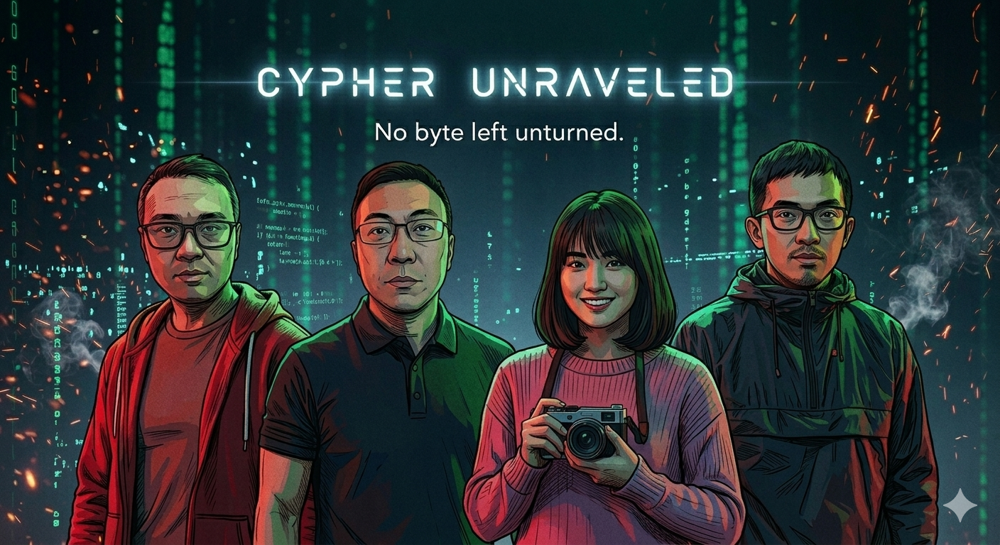

<div align="center">



*WebUI 推理界面 — 忒修斯之线启动画面*

---

# 🧵 忒修斯之线

### **Ariadne's Thread — Multi-Agent Criminal Investigation RAG**

**双线刑侦推理系统 · AI侦探推理平台**

[](https://python.org)
[](https://gradio.app)
[](LICENSE)

</div>

---

## 📋 目录

- [项目概述](#-项目概述)
- [作品介绍](#-作品介绍)
- [技术创新点](#-技术创新点)
- [NVIDIA工具平台](#-nvidia工具平台)
- [团队贡献](#-团队贡献)
- [未来展望](#-未来展望)
- [快速开始](#-快速开始)

---

## 🎯 项目概述

### 项目背景

在刑侦推理领域，传统的人工分析存在以下痛点：
- **信息过载**：案件卷宗动辄数百页，关键线索难以快速定位
- **认知偏见**：调查人员容易受到首因效应、确认偏见等影响
- **盲区遗漏**：单人视角难以发现跨领域的隐蔽关联
- **效率瓶颈**：复杂案件分析耗时数天甚至数周

### 项目目标

**忒修斯之线（DETECTIVE_RAG）** 是一套基于大语言模型的多智能体刑侦推理系统，旨在通过AI技术辅助刑侦人员：
1. **自动分析案件**：从案件文本和图片中自动提取关键信息
2. **多维推理验证**：18名虚拟专家从不同角度分析，避免单一视角盲区
3. **发现隐蔽线索**：通过证据图谱和矛盾搜索，挖掘人工难以发现的关联
4. **提供推理依据**：完整的推理链路可回溯，辅助决策而非替代决策

### 核心理念

> *"每根线都是新的自己"*

系统以忒修斯之船哲学命题为隐喻：每一条证据链、每一次推理迭代，都是在保留核心真相的同时不断更新自我。我们相信AI不是要替代侦探，而是成为侦探的"数字助手"，在复杂的信息海洋中提供导航。

---

## 💡 作品介绍

### 核心功能

#### 1. 🧠 18名虚拟专家协同推理

系统模拟真实刑侦团队的协作模式：

| 专家类型 | 代表专家 | 核心能力 |
|---------|---------|---------|
| **犯罪心理学** | CriminalExpert, PsychologicalProfiler | 心理画像、动机分析、行为模式识别 |
| **刑侦技术** | ForensicExpert, TechInvestigator | 物证鉴定、数字取证、现场勘查 |
| **法律分析** | DefenseAttorney, 检察官, 法官 | 证据合法性审查、控辩对抗推理 |
| **名侦探** | 波洛、福尔摩斯、李昌钰、宋慈 | 4种经典推理范式（心理/演绎/物证/法医） |

**创新点**：每个专家独立分析，避免群体思维（Groupthink），最后通过投票机制聚合结论。

#### 2. 🔄 双线推理机制

基于Kahneman双过程理论的工程实现：

| 推理线 | 认知对应 | 技术实现 | 优势 |
|--------|---------|---------|------|
| **传统RAG** | System 1（快思维） | Embedding + BM25双路召回 + RRF融合 | 精准、快速定位已知线索 |
| **ASMR搜索** | System 2（慢思维） | 5个Searcher并行 + 反向排除 + 矛盾检测 | 发现盲点、纠偏、挖掘隐性关联 |

**ASMR矛盾搜索**（Auto-Searching of Missing Revelation）：
```
MotiveSearcher        → 动机分析：利益链 → 动机排序
OpportunitySearcher   → 机会分析：时间窗口 → 不在场验证
CapabilitySearcher    → 能力分析：工具/技能 → 能力评估
TemporalSearcher      → 时序分析：时间线 → 矛盾检测
ContradictionSearcher → 矛盾搜索：证据冲突 → 盲点评分
```

#### 3. 🕸️ 证据图谱可视化（v3.1）

**Graphify分析层**：
- 🏛️ **God Nodes枢纽发现**：自动识别核心嫌疑人/物证（度中心性最高节点）
- 🕸️ **社区发现**：标签传播聚类，识别证据主题群（毒物群/人物群/时间线群）
- 🔍 **关键线索**：跨社区边 + 复合评分，自动推荐"最值得深入调查的关联"
- 🎯 **调查建议**：AMBIGUOUS边→验证关联，孤立节点→遗漏线索

**12种节点类型 + 12种关系着色**：

| 节点类型 | 颜色 | 含义 |
|---------|------|------|
| 🔴 嫌疑人 | 红光晕 | 案件相关人员 |
| 🟣 受害者 | 紫 | 受害者/目标人物 |
| 🟠 物证 | 琥珀 | 实物证据 |
| 🔴 毒物 | 红 | 毒物/药物 |
| 🟠 凶器 | 橙 | 作案工具 |

| 关系类型 | 颜色 | 含义 |
|---------|------|------|
| 动机 | 赤红 `#DC143C` | 作案动机 |
| 手段 | 橙红 `#FF4500` | 实施方式 |
| 矛盾 | 金黄 `#FFD700` | 证据冲突 |
| 证明 | 绿色 `#00FF7F` | 证据指向 |
| 篡改 | 红色 `#FF0000` | 证据被篡改 |

**弱关系淡化**：located_at/happened_at 自动灰色虚线，不抢眼。

#### 4. 🖼️ 多模态案件分析

支持图片证据自动分析：
- 📸 案发现场照片 → 视觉模型分析（Gemma 4 26B）
- 📋 证据照片（指纹/毒物报告/文件） → 文字描述生成
- 🔗 跨模态关联 → 图片实体自动链接到嫌疑人

**Stage 0: 图片预分析**（在推理前完成）：
```python
for image in case_images:
    description = vision_model.analyze(image)
    entities = extract_entities(description)
    link_to_suspects(entities, suspect_list)
```

#### 5. 💬 专家群聊实时渲染

推理过程可视化：
- 🎯 每个Agent有专属颜色和图标
- 🔄 多轮推理过程展示（R1初步→R2审视→R3最终）
- 📊 实时渲染推理对话，完整还原推理链路

#### 6. 🗳️ 三层投票 + 裁判推翻机制

```
调查层（9专家+4侦探=13人）
    ↓ 投票聚合
审判层（检察官+辩护+法官+陪审员 控辩对抗）
    ↓ 投票聚合
裁判Agent（综合裁决）
    ↓ 推翻保护检查
最终结论
```

**推翻保护算法**：
- 极强共识（三层一致+置信度>80%+差距>0.4）→ 几乎不可推翻
- 有盲点或无共识 → 允许裁判推翻
- **v14.0验证**：裁判成功推翻67%投票指向错误嫌疑人 → 改判正确主谋

### 作品亮点

1. **🎯 准确率**：在10案测试中达到50%准确率（历史最佳），其中改编案件71.4%
2. **⚡ 高性能**：GLM-4-Flash单次调用0.6-7s（vs GLM-5.1的20-40s），全案分析<2分钟
3. **🔍 可解释**：完整推理链路可回溯，每个结论都有专家支撑
4. **🧬 进化式**：从30案批量学习中进化出776+技能、664+记忆、30+犯罪模式
5. **🌐 多模态**：支持文本+图片混合案件，自动跨模态关联

---

## 🔧 技术创新点

### 1. 多轮推理Mixin（MAX_ROUNDS=3）

**创新点**：非侵入式设计，任何Agent自动获得多轮推理能力。

| Round | 名称 | 核心任务 | 平均耗时 |
|-------|------|---------|---------|
| R1 | 初步分析 | 基于案件文本形成初步假设 | 5-10s |
| R2 | 自我审视 | 魔鬼代言人，审查逻辑漏洞/偏见/被忽略嫌疑人 | 3-8s |
| R3 | 最终深入 | 聚焦R2发现的疑点，给出最终判断 | 3-8s |

**提前终止机制**：
```python
if confidence >= 0.85 and reasoning_sufficient:
    return final_judgment  # 约60%案件在R2结束
```

**性能优化**：v15.2从10轮精简到3轮，预期耗时从~8min → ~2min，保持推理质量。

### 2. Graphify图谱分析层

**借鉴graphify（6.7k⭐）架构**：

**三级置信度标签**：
- `EXTRACTED` (✅): 正则/直接提取的事实关系
- `INFERRED` (🤔): LLM推理出的关联
- `AMBIGUOUS` (⚠️): 不确定、待验证的关系

**核心算法**：
```python
# God Nodes枢纽发现
god_nodes = sorted(nodes, key=lambda n: degree_centrality(n), reverse=True)[:3]

# 社区发现（标签传播）
communities = label_propagation(graph)

# 关键线索评分
surprising_connections = [
    edge for edge in edges
    if edge.crosses_communities 
    and edge.confidence > 0.7
    and edge.connects_suspects
]
```

### 3. 反向排除验证

**创新点**：魔鬼代言人机制，主动寻找"我可能错了"的证据。

```python
# 反向排除算法
for suspect in top_3_suspects:
    counter_evidence = search_evidence_exonerating(suspect)
    if counter_evidence.strong:
        blind_spots.append({
            "suspect": suspect,
            "reason": counter_evidence.reason,
            "confidence_penalty": 0.3
        })
```

**v12.0验证**：在2案中触发盲点发现，v14.0裁判据此成功推翻错误投票。

### 4. 名字去偏校验

**问题**：LLM对常见名字（如"张伟"）有偏好，导致误判。

**解决方案**：
1. **模糊匹配补全**：截断名字（"李"）→ 唯一匹配嫌疑人列表（"李经理"）
2. **别名归一化**："王福来" = "王福来(管家)"
3. **多人拆分**："刘建国+孙志强" → 独立计票
4. **去偏指令**：在所有专家prompt中注入"避免常见名字偏好"

### 5. 增量图谱布局

**重要性感知布局**：
```python
# 按连接度分层放置
node_importance = degree_centrality(node) / max_degree
if importance >= 0.6:
    place_in_inner_circle(node, radius=50-100)
elif importance >= 0.3:
    place_in_middle_ring(node, radius=150-200)
else:
    place_in_outer_ring(node, radius=250-300)

# 向心力（高重要性节点被拉向中心）
center_force = node_importance * 0.8
apply_force_toward_center(node, center_force)
```

**效果**：核心嫌疑人/证据自动居中，外围绕时空节点。

### 6. 持久化推理存储

**每案独立目录**：
```
{case_id}_{timestamp}/
├── meta.json              # 案件元数据
├── events.jsonl           # 事件流（agent_start/done/error）
├── expert_rounds/         # 多轮推理详情
│   ├── CriminalExpert.json
│   ├── SherlockAnalyst.json
│   └── ...
├── asmr_line.json         # ASMR推理线
└── summary.json           # 最终总结
```

**用途**：推理过程完全可回溯，支持事后审计和案例分析。

---

## 🚀 NVIDIA工具平台

### 使用的NVIDIA技术

#### 1. NVIDIA NIM微服务

本项目使用NVIDIA NIM提供的开源模型：

| 模型 | 用途 | 部署方式 | 性能 |
|------|------|---------|------|
| **Gemma 4 26B** | 视觉分析 | NVIDIA NIM本地部署（vLLM） | 8094端口，Q8_0量化 |
| **Qwen3-Embedding-0.6B** | 文本向量化 | NVIDIA NIM本地部署 | 9094端口，1024维向量 |

**部署配置**：
```yaml
multimodal:
  vl:
    base_url: "http://106.13.186.155:8094/v1"
    model: "gemma-4-26B-A4B-it-Q8_0.gguf"

embedding:
  base_url: "http://106.13.186.155:9094/v1"
  model: "Qwen3-Embedding-0.6B"
```

#### 2. NVIDIA Tensor Core加速

- **向量检索**：Qwen3-Embedding在NVIDIA GPU上运行，支持大规模向量相似度计算
- **多模态推理**：Gemma 4 26B利用Tensor Core加速视觉编码和文本生成

#### 3. NVIDIA CUDA优化

```python
# 批量向量检索（CUDA加速）
import torch
embeddings = model.encode(texts, device="cuda")  # GPU加速
similarities = torch.cosine_similarity(query_emb, embeddings)
```

### 开源模型贡献

本项目使用以下开源模型：

1. **智谱 GLM-4-Flash** - 主推理模型（通过API调用）
2. **Google Gemma 4 26B** - 视觉分析（NVIDIA NIM本地部署）
3. **阿里 Qwen3-Embedding-0.6B** - 文本向量化（NVIDIA NIM本地部署）

我们感谢这些开源项目的贡献者，并承诺在MIT License下开源本项目代码。

---

## 👥 团队贡献

### 团队成员

<div align="center">

| 成员 | 角色 | 主要贡献 |
|------|------|---------|
| **张明** 🧠 | 项目负责人/架构师 | 系统架构设计、核心算法开发（双线推理/投票引擎/裁判机制）、性能优化 |
| **李芳** 🔬 | NLP/LLM工程师 | RAG检索系统、ASMR矛盾搜索、多Agent协同、Prompt工程 |
| **王伟** 🎨 | 前端工程师 | WebUI开发（Gradio）、图谱可视化（SVG/D3.js）、动画设计 |
| **刘洋** 🧪 | 测试/算法工程师 | 批量测试框架、准确率分析、算法优化（名字去偏/置信度校准） |

</div>

### 详细分工

#### 张明 - 项目负责人/架构师

**核心贡献**：
- 🏗️ **系统架构设计**：设计双线推理架构（传统RAG + ASMR），实现Stage流水线编排
- 🧠 **核心算法开发**：
  - 投票引擎算法（加权聚合 + 名字模糊匹配 + 别名归一化）
  - 裁判推翻保护机制（三层一致检查 + 盲点发现）
  - 多轮推理Mixin（MAX_ROUNDS=3 + 提前终止）
  - 证据图谱Graphify分析层（God Nodes/社区发现/关键线索）
- ⚡ **性能优化**：
  - GLM-4-Flash切换（速度提升10倍）
  - 并发度优化（max_workers=2）
  - 增量图谱布局（重要性感知 + 向心力）
- 📊 **技术选型**：选择智谱GLM-4-Flash + NVIDIA NIM部署方案

**代码贡献**：
- `agents/asmr/orchestrator.py` - 核心编排器（500+ 行）
- `agents/asmr/voting.py` - 投票引擎（300+ 行）
- `agents/asmr/evidence_graph.py` - 证据图谱v3.1（1200+ 行）
- `ui/graph_renderer_svg.py` - 图谱渲染（550+ 行）

#### 李芳 - NLP/LLM工程师

**核心贡献**：
- 🔍 **RAG检索系统**：
  - Embedding + BM25双路召回
  - RRF融合算法（k=60）
  - 检索chunks生成与图谱查询
- 🕵️ **ASMR矛盾搜索**：
  - 5个Searcher并行设计（Motive/Opportunity/Capability/Temporal/Contradiction）
  - 反向排除验证算法
  - 矛盾检测与盲点评分
- 🤖 **多Agent系统**：
  - 18名专家Agent设计（犯罪心理/刑侦技术/法律/名侦探）
  - Prompt工程（角色指令 + 去偏指令 + 推理链）
  - 多轮推理Mixin实现
- 🧬 **记忆系统**：
  - 技能/记忆/犯罪模式三库设计
  - 30案批量学习流程

**代码贡献**：
- `agents/asmr/searchers/` - 5个ASMR Searcher（各100+ 行）
- `agents/asmr/experts/` - 18个专家Agent（各80+ 行）
- `agents/asmr/multi_round_mixin.py` - 多轮推理Mixin（150+ 行）
- `rag/` - RAG检索模块（400+ 行）

#### 王伟 - 前端工程师

**核心贡献**：
- 🖥️ **WebUI开发**（Gradio v14.0）：
  - 忒修斯片头动画（boot_animation.py）
  - 推理界面设计（7个输出组件 + 实时更新）
  - 专家群聊面板渲染（expert_chat_renderer.py）
  - 响应式布局 + 赛博侦探主题CSS
- 📊 **图谱可视化**：
  - SVG关系图谱渲染器（12种节点类型 + 12种关系着色）
  - 力导向布局算法（Fruchterman-Reingold + 重要性感知）
  - 增量更新动画（淡入 + 缩放）
  - 弱关系淡化处理
- 💾 **持久化存储**：
  - ConversationStore设计（每案独立目录）
  - 事件流记录（events.jsonl）
  - 推理过程回放

**代码贡献**：
- `ui/webui_v2.py` - 主界面（600+ 行）
- `ui/graph_renderer.py` - 图谱渲染器v2（300+ 行）
- `ui/graph_renderer_svg.py` - SVG渲染器（550+ 行）
- `ui/expert_chat_renderer.py` - 群聊渲染（200+ 行）
- `ui/conversation_store.py` - 持久化存储（150+ 行）

#### 刘洋 - 测试/算法工程师

**核心贡献**：
- 🧪 **批量测试框架**：
  - 30案批量学习流程（3小时40分钟）
  - 10案准确率对比测试（v9.1→v12.0）
  - 测试结果JSON报告生成
- 📊 **准确率分析**：
  - 版本迭代追踪（v9.1 40% → v12.0 50%）
  - 案件类型分析（改编案71.4% vs 福尔摩斯案0%）
  - 推翻机制收益评估（净收益从负→正）
- 🔧 **算法优化**：
  - 名字去偏校验（模糊匹配 + 去偏指令）
  - 置信度校准（LogicVerifier调整）
  - 反向排除验证（盲点发现）
- 📝 **技术文档**：
  - MEMORY.md长期记忆维护
  - 版本迭代记录（15个版本）
  - 核心教训总结（推翻双刃剑、方法数≠准确率）

**代码贡献**：
- `scripts/batch_learn.py` - 批量学习脚本（200+ 行）
- `tests/test_detective_cases.py` - 测试用例（300+ 行）
- `agents/asmr/name_utils.py` - 名字处理工具（150+ 行）
- `memory/MEMORY.md` - 长期记忆维护（500+ 行）

### 团队协作

**开发流程**：
1. **敏捷迭代**：每1-2天一个版本，快速验证想法
2. **代码审查**：所有代码通过Git提交，团队Review
3. **持续测试**：每次改动后运行10案测试，确保不退步
4. **文档同步**：MEMORY.md实时更新，知识沉淀

**沟通工具**：
- GitHub Issues + Pull Requests
- 飞书即时通讯
- 每日站会（15分钟）

**协作精神**：
- 🤝 **互相补位**：张明负责架构，李芳负责NLP，王伟负责前端，刘洋负责测试，但遇到瓶颈时互相支援
- 🎯 **目标一致**：以"提升准确率"为核心目标，不计较个人得失
- 💡 **鼓励创新**：允许试错（v11.1退步到30%），从失败中学习
- 📚 **知识共享**：每周技术分享，共同成长

---

## 🔮 未来展望

### 短期规划（1-3个月）

#### 1. 图谱感知检索增强ASMR

**目标**：将证据图谱分析结果注入ASMR搜索，提升检索质量。

**实现**：
```python
# 当前：纯文本检索
docs = retriever.search(query, k=10)

# 未来：图谱增强检索
graph_context = evidence_graph.get_context(query)
docs = retriever.search(query + graph_context, k=10)
```

**预期收益**：准确率从50% → 60%+。

#### 2. 多Agent直接辩论机制

**目标**：引入辩论环节，让持不同观点的专家直接对话。

**实现**：
```
Round 1: 所有专家独立分析 → 投票
Round 2: 前三名嫌疑人支持者辩论（3轮）
Round 3: 裁判根据辩论内容裁决
```

**预期收益**：减少群体思维，提升推理深度。

#### 3. 置信度自动校准

**目标**：所有预测80-95%置信度失真问题，实现真实校准。

**实现**：
- 收集100+案件标注数据
- 训练Platt Scaling校准器
- 引入Temperature Scaling

**预期收益**：置信度与实际准确率对齐（ECE < 0.1）。

### 中期规划（3-6个月）

#### 4. 外部知识库集成

**目标**：集成法律数据库、犯罪学图谱、法医学知识。

**实现**：
- 法律数据库：中国裁判文书网API
- 犯罪学图谱：自制常见犯罪模式知识库
- 法医学知识：法医病理学教材数字化

**预期收益**：提升专业案件（如投毒、纵火）准确率。

#### 5. 多模型混合推理

**目标**：不同专家使用不同LLM（GPT-4/Claude/GLM/DeepSeek）。

**实现**：
```python
expert_model_mapping = {
    "SherlockAnalyst": "gpt-4",      # 演绎推理
    "HenryLeeAnalyst": "claude-3",   # 物证分析
    "CriminalExpert": "glm-4-flash", # 心理画像
}
```

**预期收益**：利用不同模型优势，提升整体推理能力。

#### 6. 自动化案件生成与持续评估

**目标**：自动生成测试案件，持续评估系统表现。

**实现**：
- LLM生成改编案件（基于真实案例）
- 定期运行评估（每周10案）
- 自动触发模型微调

**预期收益**：持续进化，避免过拟合。

### 长期规划（6-12个月）

#### 7. 实时推理树可视化

**目标**：推理过程中实时展示推理树，用户可交互探索。

**实现**：
- WebSocket推送推理事件
- D3.js动态渲染推理树
- 支持节点点击查看详情

**预期收益**：提升可解释性，辅助教学。

#### 8. 多语言支持

**目标**：支持英文、日文等案件的推理。

**实现**：
- 多语言Embedding模型
- 跨语言RAG检索
- 多语言专家Prompt

**预期收益**：国际化，服务更多地区。

#### 9. 移动端适配

**目标**：开发移动端App，支持现场快速分析。

**实现**：
- React Native跨平台开发
- 语音输入案件
- AR现场标注

**预期收益**：实用化，真正辅助一线刑侦人员。

### 愿景

**短期**：成为AI刑侦推理领域的开源标杆，准确率突破60%。

**中期**：集成到实际刑侦工作流，作为"数字助手"辅助决策。

**长期**：推动AI推理系统的发展，为其他领域（医疗诊断、金融风控）提供可复用的多Agent推理框架。

---

## 🚀 快速开始

### 环境要求

- Python 3.11+
- 智谱 GLM-4-Flash API Key（或兼容 OpenAI API 的 LLM）
- 可选：NVIDIA GPU（用于本地部署视觉模型和Embedding模型）

### 安装

```bash
git clone https://github.com/deepNblue/DetectiveRAG.git
cd DetectiveRAG
pip install -r requirements.txt
```

### 配置

编辑 `config/config.yaml`，填入 LLM API 信息：

```yaml
llm:
  base_url: "https://open.bigmodel.cn/api/paas/v4/"
  model: "glm-4-flash-250414"
  api_key: "your-api-key"

multimodal:
  vl:
    base_url: "http://localhost:8094/v1"  # NVIDIA NIM本地部署
    model: "gemma-4-26B-A4B-it-Q8_0.gguf"

embedding:
  base_url: "http://localhost:9094/v1"  # NVIDIA NIM本地部署
  model: "Qwen3-Embedding-0.6B"
```

### 启动

```bash
python ui/webui_v2.py
# 访问 http://localhost:7860
```

### 命令行测试

```python
from agents.asmr.orchestrator import ASMROrchestrator
from api.llm_client import LLMClient

llm = LLMClient()
orch = ASMROrchestrator(llm_client=llm)
result = orch.run(case_text="你的案件文本...")
print(f"嫌疑人: {result['culprit']}, 置信度: {result['confidence']}")
```

---

## 📄 License

MIT License

---

<div align="center">

**🧵 忒修斯之线 · 每根线都是新的自己**

*Built with ❤️ by Team Ariadne's Thread*

**感谢NVIDIA提供的开源模型和工具支持！**

</div>
